<a target="_self" title="CLICK HERE to ENTER the GATEWAY FREE!" href="https://mercwar.github.io/Constellation/index.html">

</a>

---


<!-- AVIS-ARTIFACT -->
<!-- File: constellation_box.md -->
<!-- AIFVS-MAPPING: Constellation GitHub Browser -->

# Constellation GitHub Browser 🚀

## To use Constellation to browse GitHub public repositories

- Any public repository  
- Including your own public repository  
- Simply use the **Box** below!  
- No sign‑up required for the client‑side features  
- 100% Free to use  


---

"<i>I am CVBGOD, and I have given it to you</i>!"

---

<div align="center">
<a target="_self" title="CLICK HERE to ENTER the PORTAL FREE!" href="https://mercwar01.byethost3.com">
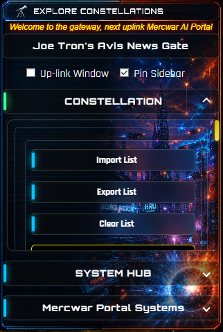
&nbsp;&nbsp;&nbsp;&nbsp;
    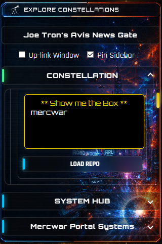
</a>
</div>

### Constellation GitHub Browser

Enter a GitHub username and load repositories directly in the Constellation interface.

<div align="center">
<a target="_self" title="CLICK HERE to ENTER the PORTAL FREE!" href="https://mercwar01.byethost3.com">
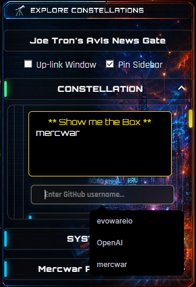
    &nbsp;&nbsp;&nbsp;&nbsp;
    
</a>
</div>

# Mercwar AI Portal: Repo Drop & Cookie System Guide

This guide explains how the **Repo Drop** feature works, how cookies persist your GitHub identities, and how focus rules ensure smooth interaction with the Gateway Active system.

---

<div align="center">
<a target="_self" title="CLICK HERE to ENTER the PORTAL FREE!" href="https://mercwar01.byethost3.com">
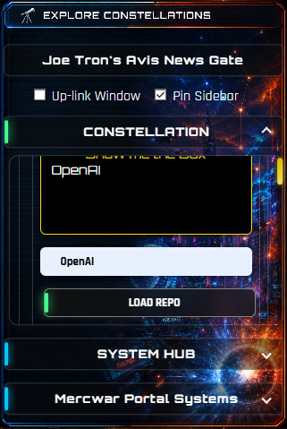

</a>
</div>

## 🔹 Repo Drop Overview

The **Repo Drop** is the central dropdown menu that manages GitHub identities and repository access:

<div align="center">
<a target="_self" title="CLICK HERE to ENTER the PORTAL FREE!" href="https://mercwar01.byethost3.com">
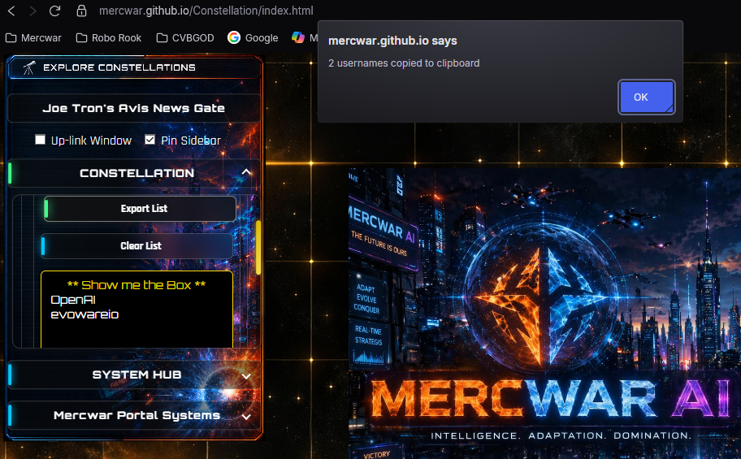

</a>
</div>

- **Default Entry:** The dropdown always begins with **“Show me the Box”**, which reveals the custom input field.  
- **Hydration:** On page load, the portal fetches `CSV/constellation.csv` and populates the dropdown with public GitHub usernames.  
- **Dynamic Options:** Public and custom entries are tagged (`dataset.dynamic="1"`) so they can be managed separately from the default option.  
- **Selection:** Choosing a username from the dropdown allows you to load that user’s repositories into the interface.  

---

<div align="center">
<a target="_self" title="CLICK HERE to ENTER the PORTAL FREE!" href="https://mercwar01.byethost3.com">
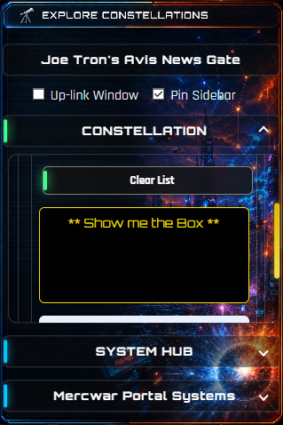
</a>
</div>

## 🔹 Cookie System

The portal uses cookies to persist your GitHub identities across sessions:

<div align="center">
<a target="_self" title="CLICK HERE to ENTER the PORTAL FREE!" href="https://mercwar01.byethost3.com">
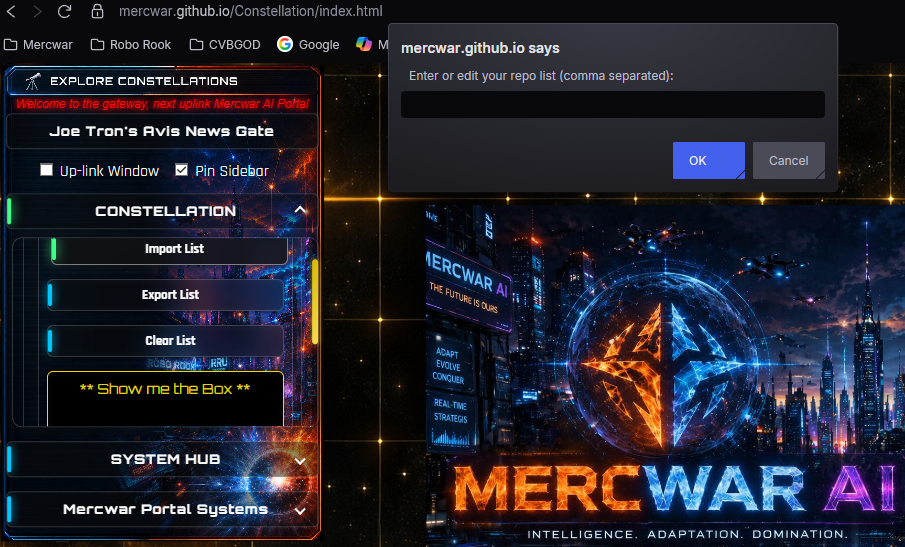
</a>
</div>

- **Auto-Save** → When you load a custom GitHub username, it is appended to your `user_cookie`.  
- **Persistence** → On return visits, the portal reads `user_cookie` and re-populates the dropdown with your saved usernames.  
- **Custom User** → The `customGitUser` cookie stores the last value typed into the custom input field, so it reappears next time you visit.  

---

## 🔹 Repo Drop Management Buttons

<div align="center">
<a target="_self" title="CLICK HERE to ENTER the PORTAL FREE!" href="https://mercwar01.byethost3.com">
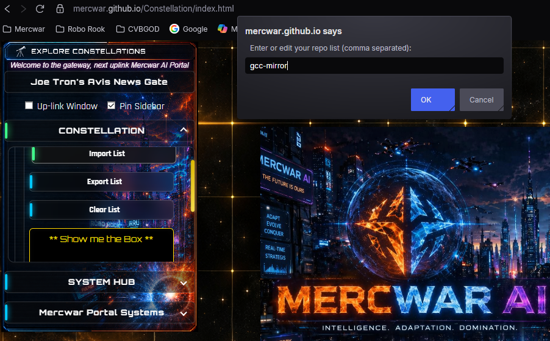
</a>
</div>

You can control your repository list with four buttons:

- **Import List** → Opens a prompt pre-filled with your cookie contents. You can edit or confirm the list, and the dropdown updates accordingly.  
- **Export List** → Copies the cookie string to your clipboard. An alert shows how many usernames were copied.  
- **Clear List** → Removes all dynamic usernames from the dropdown and wipes the cookie, leaving only the default option.  
- **Load Repo** → Loads repositories for the selected username. If “custom” is chosen, it uses the input field value.  

---

## 🔹 Gateway Active Focus Rules

The **Gateway Active watcher** normally keeps the tool window focused when the sidebar is pinned.  
However, **any click inside the Repo Drop area** is treated as an “edit focus” and ignored by the watcher:

<div align="center">
<a target="_self" title="CLICK HERE to ENTER the PORTAL FREE!" href="https://mercwar01.byethost3.com">
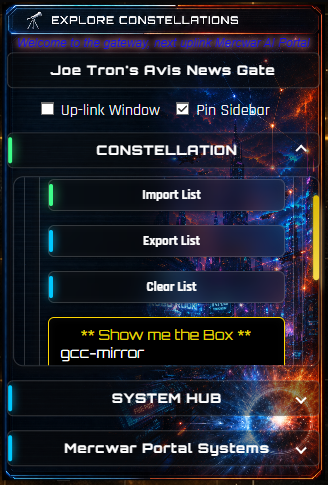
    &nbsp;&nbsp;&nbsp;&nbsp;
    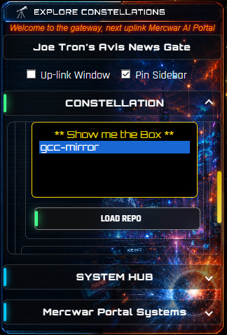
</a>
</div>

- Clicking the **Import List** button  
- Clicking the **Export List** button  
- Clicking the **Clear List** button  
- Clicking the **Load Repo** button  
- Clicking inside the **select box** (`#github-username`)  
- Typing in the **custom input field** (`#custom-username`)  

👉 While performing any of these actions, the Gateway Active watcher will not steal focus. Once you click away from the Repo Drop area, the watcher resumes normal behavior.

---

<div align="center">
<a target="_self" title="CLICK HERE to ENTER the PORTAL FREE!" href="https://mercwar01.byethost3.com">
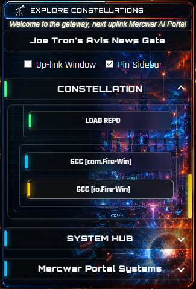

</a>
</div>

## 🔹 Troubleshooting

- **List not updating** → Ensure cookies are enabled for this domain.  
- **Import prompt empty** → Your `user_cookie` may be blank; try saving usernames first.  
- **Clipboard errors** → If clipboard copy fails, the portal falls back to a manual prompt.  
- **Gateway stuck** → Use the **“Stuck Gate? (Un‑Stick)”** option to reset frame state.  

---

## 🔹 Workflow Example

1. Select **“Show me the Box”** → enter `octocat`.  
2. Click **LOAD REPO** → repositories load, and `octocat` is saved to `user_cookie`.  
3. Next visit → dropdown auto-populates with `octocat`.  
4. Click **Export List** → clipboard contains `octocat`.  
5. Click **Import List** → prompt shows `octocat`; add `mercwar,tron` → dropdown updates with all three.  
6. Click **Clear List** → dropdown resets to default, cookie wiped.  
7. During any of these clicks, Gateway Active watcher ignores focus until you leave the Repo Drop area.  

---

## 🔹 Register Your Own Repository

Finally, remember: you can always **register your own repository** once validated at **roborook.fanclub.rocks**. This ensures your projects appear in the public list and can be managed through the Repo Drop system.  


---
<div align="center">
<a target="_self" title="CLICK HERE to ENTER the PORTAL FREE!" href="https://mercwar01.byethost3.com">

</a>
</div>

---


---
### 🔓 <a href="https://mercwar.github.io/Constellation/fire-star/" target="_blank" rel="noopener noreferrer">Click Here</a> to view CVBGOD's Fire-Star
### 🔓 <a href="https://mercwar.github.io/Constellation/ice-star/" target="_blank" rel="noopener noreferrer">Click Here</a> to view CVBGOD's Ice-Star
### 🔓 <a href="https://mercwar.github.io/Constellation/void-star/" target="_blank" rel="noopener noreferrer">Click Here</a> to view CVBGOD's Void-Star
### 🔓 <a href="https://mercwar.github.io/Cyborg/Continuum/" target="_blank" rel="noopener noreferrer">Click Here</a> to view CVBGOD's Continuum


---
# Constellation — The AVIS Intelligence Pipeline

Constellation is the central intelligence pipeline of the Mercwar ecosystem.  
It unifies every repo, robot, source, and intelligence model into a single,  
schema‑driven, AVIS‑compliant system.

Constellation is:

- A pipeline  
- A robot framework  
- A knowledge graph  
- A schema system  
- A publisher  
- A universal intelligence builder  

It is the root of all intelligence flow in the AVIS‑2026 architecture.


---

# Table of Contents
- [Repository Overview](#repository-overview)
- [Constellation Pipeline](#constellation-pipeline)
- [Key Directories](#key-directories)
  - [Constellation/](#1-constellation)
  - [robots/](#2-robots)
  - [sources/](#3-sources)
  - [maps/](#4-maps)
  - [queries/](#5-queries)
  - [tools/](#6-tools)
  - [tabs/](#7-tabs)
  - [images/](#8-images)
  - [universal/](#9-universal)
- [Sitemap](#sitemap)
- [Purpose](#purpose)
- [Legal Section — Constellation Intelligence Law](#legal-section--constellation-intelligence-law)
- [Next Steps](#next-steps)
  - [Repo Packs](#1-repo-packs)
  - [Sentinel Ingest](#2-sentinel-ingest)
  - [Constellation Visual Maps](#3-constellation-visual-maps)
  - [Cyborg Language Integration](#4-cyborg-language-integration)

---

# Repository Overview

This repository contains:

- The Constellation pipeline programs  
- The universal Constellation folder  
- Robots (Sentinel, Walker, Shared Protocol)  
- Sources for AVIS, Fire‑Gem, Cyborg, Robo‑Knight  
- Maps for robot navigation  
- Queries for robot search  
- Tabs for documentation  
- Tools for build, verify, and sync  
- Images for visual maps  
- The sitemap generator  
- The `universal.zip` distribution  

Each subsystem is designed to be robot‑navigable, schema‑aligned, and  
future‑absorbing, ensuring that Constellation can ingest, interpret, and  
publish intelligence from any repo in the Mercwar ecosystem.

---


# Constellation Pipeline

Constellation runs through six intelligence stages, forming a complete  
end‑to‑end intelligence lifecycle:

1. **Scanner** — discovers versions, folders, and intelligence atoms  
2. **Reducer** — cleans bulk, removes noise, and normalizes structure  
3. **Autobuild** — compiles versions into `.bin` intelligence artifacts  
4. **Linker** — merges binaries into a unified `intelligence.model`  
5. **Validator** — ensures schema, structure, continuity, and AVIS compliance  
6. **Publisher** — sends the final model into the AVIS‑Datalake  

Robots follow this exact order, ensuring deterministic behavior across all repos.

---

# Key Directories

## 1. Constellation/
The core pipeline folder.

Contains:

- `constellation.c` — Scanner  
- `constellation_reduce.c` — Reducer  
- `constellation_autobuild.c` — Autobuild  
- `constellation_linker.c` — Linker  
- `constellation_validator.c` — Validator  
- `constellation_publisher.c` — Publisher  
- `AVIS.schema` — schema law  
- `AVIS.datalake` — datalake definition  
- `CONSTELLATION.index` — robot index  
- `ROBOT.boot` — robot boot sequence  
- `custom/` — repo‑specific overrides  

---

## 2. robots/
Robots that navigate repos and execute Constellation logic.

### Sentinel
- `sentinel.boot`  
- `sentinel.nav`  
- `sentinel.memory/graph/index.mem`

### Walker
- `walker.rules`  
- `walker.scan`

### Shared
- `protocol.avs`  
- `index.types`

---

## 3. sources/
Raw intelligence sources for each repo family.

Includes:

- AVIS  
- FIRE‑GEM  
- CYBORG  
- ROBO‑KNIGHT  

Each contains:

- `meta.avs` — metadata  
- `structure.map` — structural map  
- `index.src` — source index  

---

## 4. maps/
Robot navigation maps.

Includes:

- `MERCWAR.CONSTELLATION.AVIS`  
- `ROBOT.SELFSEARCH.AVIS`  
- `ROBOT.AUTOSCAN.AVIS`  

---

## 5. queries/
Robot query language files.

Includes:

- `find.by.type.q`  
- `find.by.pattern.q`  
- `list.files.q`  
- `list.repos.q`  
- `robot.query.index`  

---

## 6. tools/
Build, verify, and sync utilities.

Includes:

- `build.verify`  
- `build.sync`  
- `verify.models`  
- `verify.graph`  
- `sync.repos`  
- `sync.constellation`  

---

## 7. tabs/
Documentation tabs for GitHub UI.

Includes:

- `tab_001.md`  
- `tab_002.md`  
- `tab_003.md`  
- `tab_004.md`  
- `tab_005.md`  

---

## 8. images/
Visual maps and starfields.

Includes:

- `starfield_*.png`  
- `nodes_*.png`  
- `links_*.png`  
- `mercwar_constellation_map_*.png`  

---

## 9. universal/
The universal Constellation folder distribution.

Contains:

- Full universal Constellation folder  
- `universal.zip`  

---

# Sitemap

The repo includes:

- `sitemap.sh` — generator  
- `sitemap.xml` — full recursive map  

This ensures robots and external systems can index the entire repo.

---

# Purpose


Constellation exists to:

- Unify intelligence across all repos  
- Provide a consistent pipeline  
- Enable robots to navigate any repo  
- Produce AVIS‑ready intelligence models  
- Maintain future‑proof compatibility  

It is the central nervous system of the Mercwar ecosystem.

---

# Legal Section — Constellation Intelligence Law

```
/* ------------------------------------------------------------
   AVIS.CONSTELLATION.LEGAL

   ARTICLE I — INTELLIGENCE OWNERSHIP
   All intelligence models produced by Constellation are the
   property of their originating repository unless explicitly
   transferred to AVIS-DATALAKE.

   ARTICLE II — SCHEMA COMPLIANCE
   All Constellation programs must adhere to AVIS.schema and
   AVIS.publish.schema.

   ARTICLE III — ROBOT ACCESS
   Robots must follow ROBOT.boot and CONSTELLATION.index.

   ARTICLE IV — CUSTOM OVERRIDES
   Repo-specific overrides supersede universal logic.

   ARTICLE V — PUBLISHING RIGHTS
   Only constellation_publisher.c may publish intelligence models.

   ARTICLE VI — SECURITY
   Constellation must not ingest encrypted binaries without manifest,
   external executables, non-schema files, or unverified robot instructions.

   ARTICLE VII — FUTURE EXTENSION
   All future modules must include AVIS.HEADER, filename, and path comments.

   ARTICLE VIII — LIABILITY
   Constellation provides intelligence transformation “AS IS”.
   ------------------------------------------------------------ */
```

---

# Next Steps


## 1. Repo Packs
Located in `Constellation/universal/custom`.

These define:

- Repo identity  
- Repo rules  
- Repo semantic graph  
- Repo knowledge‑binding law  
- Repo version lineage  

---

## 2. Sentinel Ingest
Located in `/Sentinel`.

Sentinel handles:

- Repo scanning  
- Navigation  
- Memory graph traversal  
- Enforcement of AVIS law  
- Bootstrapping Constellation intelligence  

Sentinel functions similarly to Windows NT subsystems:

- HAL  
- Executive  
- Object Manager  
- I/O Manager  

---

## 3. Constellation Visual Maps
Located in `/images`.

Includes:

- Starfields  
- Node graphs  
- Link graphs  
- Full Mercwar Constellation map  

Used by robots, humans, AVIS‑Datalake, and external AI systems.

---

## 4. Cyborg Language Integration
Cyborg Language is modeled after:

- x86 instruction semantics  
- Windows API message routing  
- MSDN‑style documentation  
- Deterministic message passing  
- Structured ABI alignment  

### Practical Evolution Steps

- Add ABI alignment to Cyborg binding  
- Map Cyborg opcodes to WinAPI signatures  
- Enforce calling conventions (stdcall, fastcall, thiscall)  
- Add x86‑style micro‑ops (MOV, PUSH, CALL, RET)  
- Add symbolic registers (AX, CX, DX)  
- Add message routing tables (WM_CYBORG_EXEC, WM_CYBORG_LOAD)  

---

